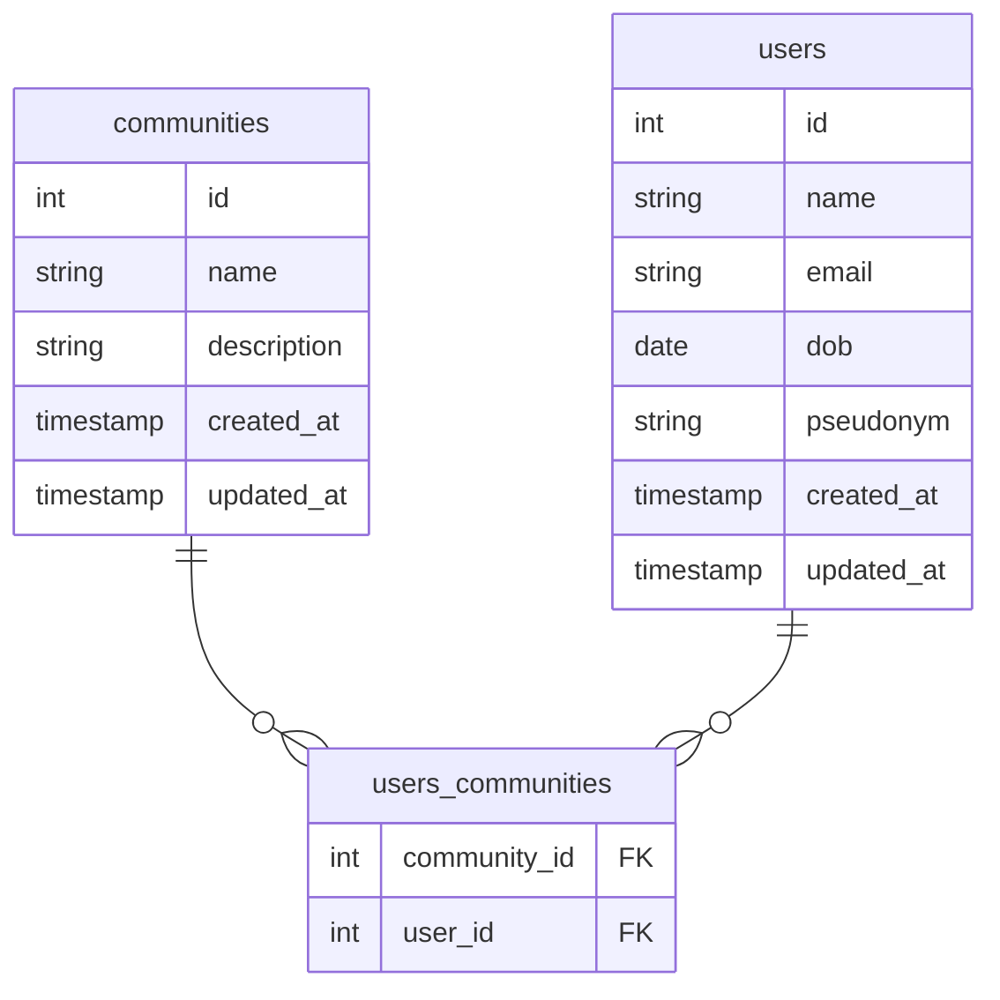

# Minkoo Physical Data Model

- DBMS: PostgreSQL

```mermaid
erDiagram
  communities ||--o{ users_communities : ""
  users ||--o{ users_communities : ""


  communities {
    int id
    string name
    string description
    timestamp created_at
    timestamp updated_at
  }
  users {
    int id
    string name
    string email
    date dob
    string pseudonym
    timestamp created_at
    timestamp updated_at
  }
  users_communities {
    int community_id FK
    int user_id FK
  }
```
